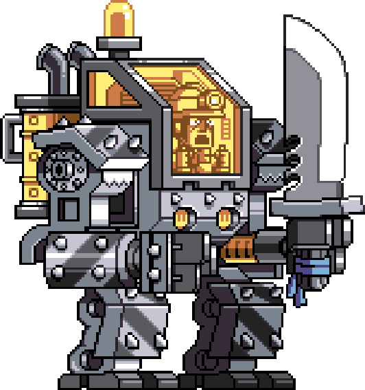

<div align="center">
    <head>
        <link rel="preconnect" href="https://fonts.googleapis.com">
        <link rel="preconnect" href="https://fonts.gstatic.com" crossorigin>
        <link href="https://fonts.googleapis.com/css2?family=Press+Start+2P&display=swap" rel="stylesheet">
    </head>
    <h1 style="color: aliceblue; font-family: 'Press Start 2P', cursive; font-size: 50px">
    Simple Game
    </h1>
    
    
</div>

<div>
    <h2 style="color: aliceblue; font-family: 'Press Start 2P', cursive; font-size: 22px">Installing</h2>

```shell
git clone https://github.com/neonabuko/simplegame

cd simplegame

cmake --build cmake-build-debug --target simplegame -j 10

cd cmake-build-debug && ./simplegame
```
</div>