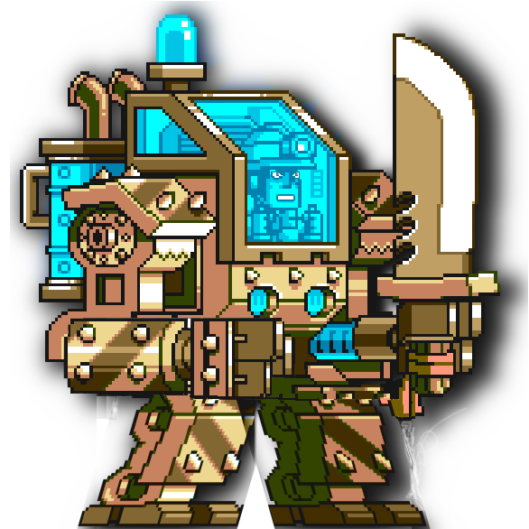
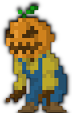

<div align="center">
<h1 style="font-size: 48px">Simple Game</h1>


</div>

<div>
<h2>Installing</h2>

```shell
git clone https://github.com/neonabuko/simplegame

cd simplegame

mkdir build && cd build

cmake ..

cmake --build .
```

<h2>Running</h2>

```shell
cd simplegame/build/

./simplegame
```

</div>