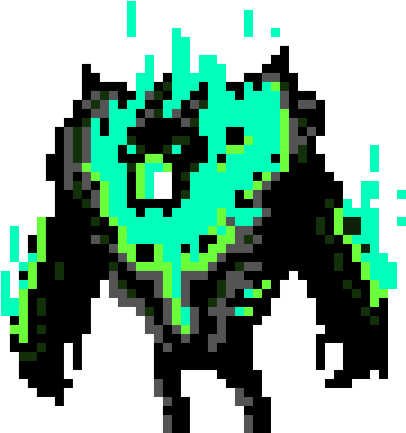

<div align="center">
<h1 style="font-size: 48px">Simple Game</h1>


</div>

<div>
<h2>Installing</h2>

```shell
git clone https://github.com/neonabuko/simplegame

cd simplegame

cmake --build cmake-build-debug --target simplegame -j 10
```

<h2>Running</h2>

```shell
cd cmake-build-debug && ./simplegame
```

</div>